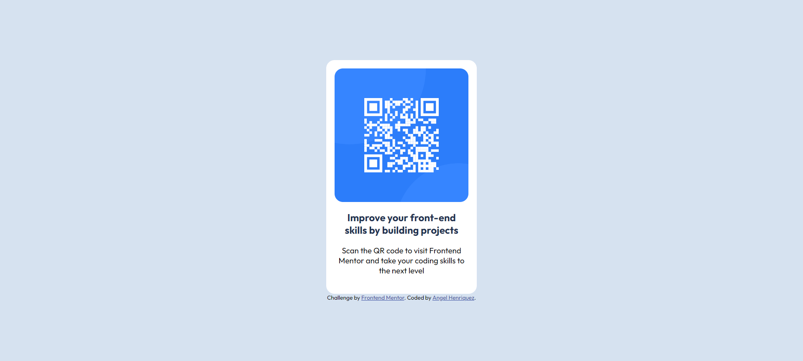

# Frontend Mentor - QR code component solution

This is a solution to the [QR code component challenge on Frontend Mentor](https://www.frontendmentor.io/challenges/qr-code-component-iux_sIO_H). Frontend Mentor challenges help you improve your coding skills by building realistic projects. 

## Table of contents

- [Overview](#overview)
  - [Screenshot](#screenshot)
  - [Built with](#built-with)
  - [What I learned](#what-i-learned)
  - [Continued development](#continued-development)
  - [Useful resources](#useful-resources)
- [Author](#author)

## Overview
In this challange I'm building a Qr Code component from Frontend Mentor.

### Screenshot



### Built with

- Semantic HTML5 markup
- CSS custom properties
- Flexbox

### What I learned

I learned a better understanding of the top property and the relative position.
I learned how to work with variables in CSS.

```css
:root {
      --white-color: hsl(0, 0%, 100%);
      --light-gray-color: hsl(212, 45%, 89%);
      --grayish-blue-color: hsl(220, 15%, 55%);
      --dark-blue-color: hsl(218, 44%, 22%);
    }
```

### Continued development

I would like to continue learning and reinforcing the position property and how to center a div vertically.

### Useful resources

- [Variables in CSS](https://developer.mozilla.org/es/docs/Web/CSS/Using_CSS_custom_properties) - This helped me working with variables.

## Author

- Frontend Mentor - [@yourusername](https://www.frontendmentor.io/profile/yourusername)
- Instagram - [@angel_http404](https://www.instagram.com/angel_http404/)
- Linkedin - [Angel Ivan Henríquez Martínez](https://www.linkedin.com/in/angel-ivan-henr%C3%ADquez-mart%C3%ADnez-16a6b6218/)
